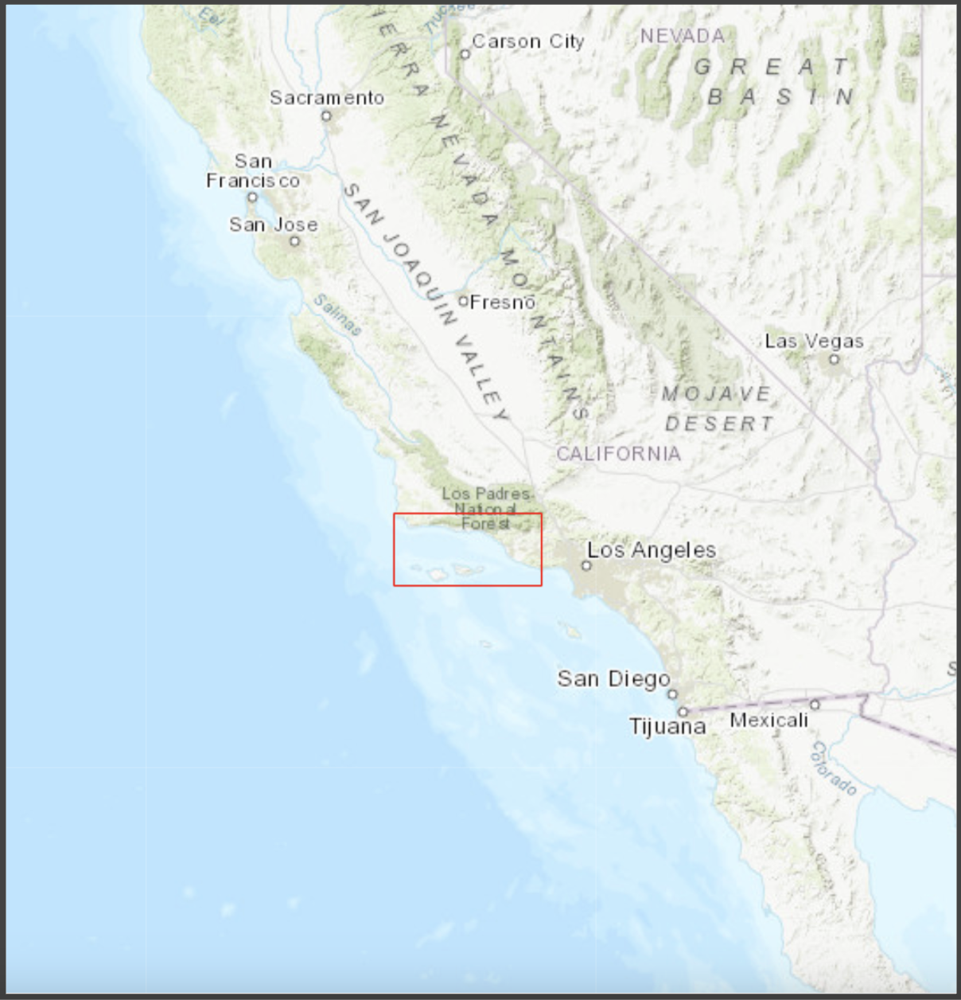
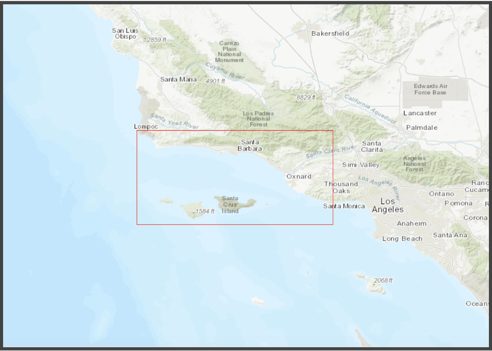

# kelpGeoMod-capstone-project

#### DEVELOPING A DATA PIPELINE FOR KELP FOREST MODELING

##### *This README.txt file was generated on 2023-05-02 by kelpGeoMod team*

[{width="100%"}](https://www.economist.com/united-states/2021/06/26/why-new-england-is-going-wild-for-wet-weeds)

## **CONTACT INFORMATION**

#### Principal Investigator Contact Information

-   Erika Egg - [egg\@bren.ucsb.edu](mailto:egg@bren.ucsb.edu){.email}

-   Jessica French - [jfrench\@bren.ucsb.edu](mailto:jfrench@bren.ucsb.edu){.email}

-   Javier Patrón - [jpatron\@bren.ucsb.edu](mailto:jpatron@bren.ucsb.edu){.email}

-   Elke Windschitl - [elke\@bren.ucsb.edu](mailto:elke@bren.ucsb.edu){.email}

#### Associate or Co-investigator Contact Information

-   Natalie Dornan (UCSB IGPMS) - [nataliedornan\@bren.ucsb.edu](mailto:nataliedornan@bren.ucsb.edu){.email}

#### Alternate Contact Information (Sam)

-   Samantha Stevenson (UCSB Bren School) - [stevenson\@bren.ucsb.edu](mailto:stevenson@bren.ucsb.edu){.email}

#### 

## **GENERAL INFORMATION**

#### Date of data collection or obtaining

-   Obtained: January and February 2023

-   Date Range: 1st January 2014 - 31st December 2022

#### Geographic location of data collection:

-   Point 1: -120.65, 34.59

-   Point 2: -118.80, 34.59

-   Point 3: -118.80, 33.85

-   Point 4: -120.65, 33.85

{width="70%"}

{width="70%"}

## **SHARING/ACCESS INFORMATION**

#### Licenses/restrictions placed on the data:

The present project is subject to the Creative Commons Attribution license, whereby all data sets utilized are publicly available. However, our proprietary cleaning and normalization techniques fall under this license. Accordingly, our processed data will be publicly accessible through our [repository](https://github.com/kelpGeoMod/kelpGeoMod-capstone-project). It is pertinent to acknowledge that every data set utilized in this project was accompanied by specific usage restrictions, requiring an individualized review and analysis for each source.

#### Data Sources:

Observed Data:

-   [Kelp](https://sbclter.msi.ucsb.edu/data/catalog/package/?package=knb-lter-sbc.74)

Environmental Factors:

-   [SST](https://podaac.jpl.nasa.gov/dataset/MUR-JPL-L4-GLOB-v4.1?ids=Keywords&values=Oceans:Ocean%20Temperature&provider=POCLOUD)

-   [Depth](https://www.ncei.noaa.gov/products/etopo-global-relief-model)

-   [LTER Bottle](https://sbclter.msi.ucsb.edu/data/catalog/package/?package=knb-lter-sbc.10)

-   [LTER Waves](https://sbclter.msi.ucsb.edu/data/catalog/package/?package=knb-lter-sbc.144)

-   [CalCOFI](https://calcofi.org/data/oceanographic-data/bottle-database/)

-   [USGS 2018](https://www.sciencebase.gov/catalog/item/62a7ac5ad34ec53d2770c81f)

-   [USGS 2019](https://www.sciencebase.gov/catalog/item/62aa40bad34ec53d277115ce)

-   [Plumes and Blooms](http://www.oceancolor.ucsb.edu/plumes_and_blooms/)

## **DATA & FILE OVERVIEW**

#### File List:

This [link](https://docs.google.com/spreadsheets/d/1HR_xrE1kTqQGN9MN0-n7XIuDMotM1v1e56kE6-YUFT4/edit#gid=0) provides a list all files contained in the data set, with a brief description of their content. You need a UCSB email address for access. If you don't please contact the principal investigators.

#### Relationship between files

Each data file in this portion of the project is independent of one another. In general the data pipeline progresses from lower numbered R scripts to higher number R scripts.

Currently there is one version of the raw data in our project. See above links to investigate versions of the original data.

## **METHODOLOGICAL INFORMATION**

### Description of methods used for collection/generation of data:

See links above and information below on how data were joined.

### Methods for processing the data:

#### SST:

1.  **`ncdf_to_raster`** function:

    -   This function takes each NetCDF file, converts the temperature values from Kelvin to Celsius, and converts the resulting data to a raster object.

    -   The raster is then masked to match a pre-defined `mask`\` and returned as output.

2.  **`create_raster_stack_quarterly`** function: This function is created to split and categorize the quarters so that the mean temperature for each category can be calculated.

    -   This function creates a raster stack for a given year and quarter by subsetting file_df to include only files from the specified time period.

    -   The function then applies the **`ncdf_to_raster`** function to each file in the subset, creating a list of rasters.

    -   The list of rasters is then converted into a RasterStack object

    -   The **`mean`** function is then applied to each layer of the RasterStack object using the **`calc`** function to calculate the mean value of each pixel across all layers.

    -   The resulting quarter RasterLayer object containing the mean values is returned as output.

3.  **`create_raster_brick`** function:

    -   This function takes the values of the quarters and years of interest.

    -   The function uses **`create_raster_stack_quarterly`** function to create a raster stack for each quarter in each year of interest.

    -   The resulting raster stacks are combined into a raster brick using the **`brick`** function.

    -   The resulting raster brick contains all 36 rasters (4 quarters per 9 years from 2014-2022).

    -   This function is useful for creating a single raster object that contains all the data of interest.

4.  The **`calc_seasonal_means_brick`** function is used to generate seasonal averages with the 36 individual quarter raster bricks.

    -   It calculates the mean of all layers in the input brick corresponding to each season (i.e., winter, spring, summer, fall) and stores them in a new raster brick with four layers.

    -   The function writes each layer of the new raster brick as a GeoTIFF file to disk.

#### DEPTH:

1.  Wrangled into a tidy format Filtered to time frame of 2014-2022

2.  Mask applied to meet 0.008° x 0.008° spatial resolution, 33.85°- 34.59°N, 118.8°- 120.65°W extent & position, coordinate reference system WGS 84

#### KELP AREA & BIOMASS:

1.  Get area and biomass information from the raw netCDF using a for loop, limiting to our time period and area of interest.

2.  Generate a data frame with both variables' information.

3.  Turn this into a spatial data frame and rasterize area and biomass separately into two rasterStacks

4.  Aggregate these two rasterStacks closer to the correct resolution by summing, and then resample so that the mask can be applied

5.  Mask applied to meet 0.008° x 0.008° spatial resolution, 33.85°- 34.59°N, 118.8°- 120.65°W extent & position, coordinate reference system WGS 84

#### NUTRIENTS:

1.  Wrangled into a tidy format Filtered to time frame of 2014-2022

2.  Joined into one data frame Interpolated using inverse distance weighting with an inverse distance power of 1 and maximum distance parameter of 0.08° (approx. 10 km) on phosphate, ammonium, and combined nitrate and nitrite point data.

3.  The scope of interpolation was limited to 5 km off the Santa Barbara Coast to ensure dense enough data coverage.

4.  Mask applied to meet 0.008° x 0.008° spatial resolution, 33.85°- 34.59°N, 118.8°- 120.65°W extent & position, coordinate reference system WGS 84

#### Instrument- or software-specific information needed to interpret the data:

-   R version 4.2.2

-   RStudio Version: 2023.03.0+386 "Cherry Blossom" Release (3c53477afb13ab959aeb5b34df1f10c237b256c3, 2023-03-09) for macOS

-   Mozilla/5.0 (Macintosh; Intel Mac OS X 10_15_7)

-   AppleWebKit/537.36 (KHTML, like Gecko)

-   RStudio/2023.03.0+386

-   Chrome/108.0.5359.179

-   Electron/22.0.3

-   Safari/537.36

-   QGIS Version: 3.28.3-Firenze

#### R-packages used:

| **Package** | **Version** | **Description**                                                                                                                 |
|-------------------|-------------------|----------------------------------|
| abind       | 1.4-5       | Combines multi-dimensional arrays into a single array.                                                                          |
| dplyr       | 1.1.0       | Provides a set of tools for working with data frames in a clear and consistent way.                                             |
| forcats     | 0.5.2       | Provides tools for working with categorical data in a tidy way, including tools for reordering, recoding, and summarizing data. |
| gganimate   | 1.0.8       | Allows for the creation of animated ggplot2 graphics.                                                                           |
| ggplot2     | 3.4.1       | Provides a system for creating graphics using a grammar of graphics, allowing for high-level plotting with minimal code.        |
| httr        | 1.4.5       | Provides tools for working with web APIs.                                                                                       |
| janitor     | 2.1.0       | Provides tools for cleaning and tidying data.                                                                                   |
| lubridate   | 1.8.0       | Provides tools for working with date and time data.                                                                             |
| ncdf4       | 1.21        | Provides tools for reading and writing netCDF data.                                                                             |
| naniar      | 1.0.0       | Provides tools for working with missing data.                                                                                   |
| purrr       | 1.0.1       | Provides tools for functional programming and iteration in R.                                                                   |
| raster      | 3.6-3       | Provides tools for working with raster data.                                                                                    |
| readr       | 2.1.3       | Provides tools for reading and writing delimited text files.                                                                    |
| sf          | 1.0-8       | Provides tools for working with vector (point, line, polygon) data in a tidy way.                                               |
| sp          | 1.6-0       | Provides tools for working with spatial data in R.                                                                              |
| stars       | 0.5-6       | Provides tools for working with spatiotemporal data in R.                                                                       |
| stringr     | 1.5.0       | Provides tools for working with strings in a tidy way.                                                                          |
| terra       | 1.6-17      | Provides tools for working with raster and vector data.                                                                         |
| tidyr       | 1.3.0       | Provides tools for tidying data.                                                                                                |
| tibble      | 3.2.1       | Provides tools for working with tabular data in a tidy way.                                                                     |
| tictoc      | 1.1         | Provides tools for measuring and reporting execution time of R expressions.                                                     |
| tmap        | 3.3-3       | Provides tools for creating thematic maps.                                                                                      |

## **DATA-SPECIFIC INFORMATION FOR:**

#### `synthesized-dataset.csv`

1**. Number of variables:** 10

**2. Number of cases/rows:** 54065

**3. Variable List:**

| **Variable Name** | **Units/ Range**             | **Type**       | **Description**                               |
|------------------|------------------|------------------|-------------------|
| quarter           | Range [1-4]                  | Numerical data | Quarter number per year. Range 1-4            |
| year              | Range [2014-2023]            | Numerical data | Data year                                     |
| lat               | decimal degrees              | Numerical data | Latitude in degrees                           |
| lon               | decimal degrees              | Numerical data | Longitudes in degrees                         |
| depth             | meters                       | Numerical data | Ocean depth in meters                         |
| sst               | celsius                      | Numerical data | Sea Surface temperature in Celsius            |
| area              | meters squared               | Numerical data | Kelp area                                     |
| biomass           | kilograms                    | Numerical data | Kelp biomass                                  |
| phosphate         | mcmol/L (micromol per liter) | Numerical data | Concentration of phosphate in water           |
| nitrate_nitrite   | mcmol/L (micromol per liter) | Numerical data | Concentration of nitrate and nitrite in water |
| ammonium          | mcmol/L (micromol per liter) | Numerical data | Concentration of ammonium in water            |

#### Recommended Citation for the Project:

Egg, E., French, J., Patrón, J., & Windschitl, E. (2023). Developing a Geospatial Model for Kelp Forest Cultivation and Restoration. kelpGeoMod. <https://github.com/kelpGeoMod/kelpGeoMod-capstone-project>.

People involved with sample collection, processing, analysis, and/or submission: Please refer to the original data sources for individual sample collection information. For data retrieval and synthesis, the following individuals were involved: Erika Egg (UCSB), Jessica French (UCSB), Javier Patrón (UCSB), and Elke Windschitl (UCSB).

### Acknowledgements

We acknowledge the Bren School of Environmental Science & Management's Master's of Environmental Data Science program at the University of California Santa Barbara for funding this synthesis project. We would also like to express our gratitude to our clients, Courtney Schatzman from Ocean Rainforest and Natalie Dornan from UCSB interdepartmental Graduate Program in Marine Science (IGPMS), as well as Sidney Gerst and Kirby Bartlett for providing user information, Jeff Massen for user testing and being the main contact as a kelp farmer, and Daphne from NCEAS for helping us explore different options for MaxEnt modeling. We are also grateful to Tamma Carleton for her valuable input during brainstorming meetings regarding statistics and model testing.

{alt="The Economist GreenWave image" width="90%" style="display: block; margin: auto;"}

{width="40%" style="display: block; margin: auto;"}

