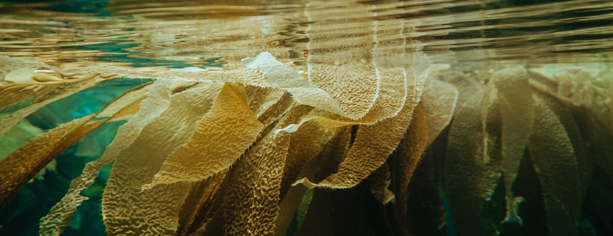
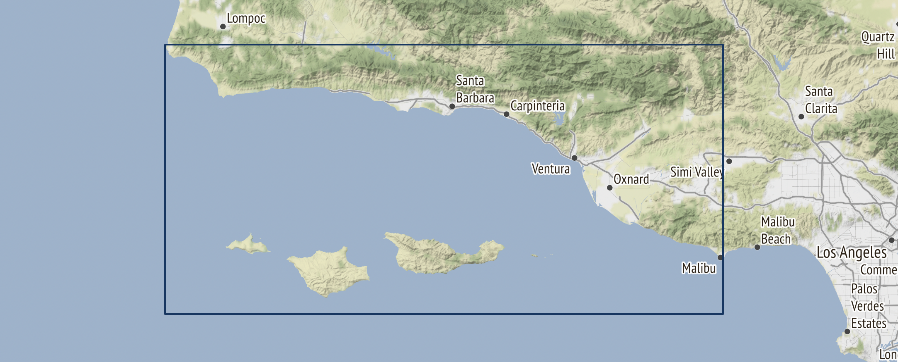
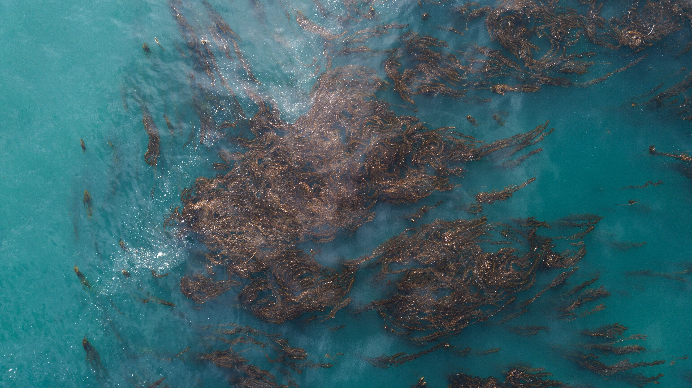

# DEVELOPING A DATA PIPELINE FOR KELP FOREST MODELING

#### kelpGeoMod, A Capstone Project submitted in partial satisfaction of the requirements for the degree of Master of Environmental Data Science for the Bren School of Environmental Science & Management

Giant kelp (Macrocystis pyrifera) is an ecosystem engineer that creates complex vertical habitat by growing to approximately 50 m in dense forests. Healthy kelp forests are some of the most diverse ecosystems in the world that also protect coastlines from storms, provide nutrients to beaches, and giant kelp is a promising biofuel precursor that does not take up arable land or use freshwater to grow. Researchers are working to better understand nutrient utilization and cycling in this critical ecosystem and need comprehensive data on nutrient concentrations to further their research. Additionally, kelp aquaculture companies are working to show that giant kelp can be grown as a profitable biofuel precursor in the Santa Barbara Channel. In order to do this they need to grow kelp efficiently in areas that have suitable habitat. This project creates a synthesized data set that can be used and expanded on by researchers to make their data acquisition process more efficient. It also produces estimates of habitat suitability for giant kelp in the Santa Barbara Channel that kelp aquaculture organizations can use to supplement prior analyses and guide where to place future farms.

To review the entire project please read the [technical documentation.](https://docs.google.com/document/d/1cjxZnd0RZNg_o5NuBgrulogFgRhWddKm/edit#)

## **CONTACT INFORMATION**

#### Principal Investigator Contact Information

-   Erika Egg - [egg\@bren.ucsb.edu](mailto:egg@bren.ucsb.edu)

-   Jessica French - [jfrench\@bren.ucsb.edu](mailto:jfrench@bren.ucsb.edu)

-   Javier Patrón - [jpatron\@bren.ucsb.edu](mailto:jpatron@bren.ucsb.edu)

-   Elke Windschitl - [elke\@bren.ucsb.edu](mailto:elke@bren.ucsb.edu)

#### Associate or Co-investigator Contact Information

-   Natalie Dornan (UCSB IGPMS) - [nataliedornan\@bren.ucsb.edu](mailto:nataliedornan@bren.ucsb.edu)

#### Alternate Contact Information (Sam)

-   Samantha Stevenson (UCSB Bren School) - [stevenson\@bren.ucsb.edu](mailto:stevenson@bren.ucsb.edu)

## **GENERAL INFORMATION**

#### Date of data collection or obtaining

-   Obtained: January and February 2023

-   Date Range: 1st January 2014 - 31st December 2022

#### Geographic location of data collection:

-   Coordinates used to delimit the Santa Barbara Channel 33.85°- 34.59°N, 118.8°- 120.65°W

    

## **SHARING/ACCESS INFORMATION**

#### Licenses/restrictions placed on the data:

All the final product and data sets were published under the Creative Commons Zero (CC0) intellectual property laws to enable public use. This was done to promote transparency, facilitate data sharing, and enable external users, such as researchers, stakeholders, and kelp farmers, to access and use our project's data. Accordingly, our processed data will be publicly accessible through our [repository](https://github.com/kelpGeoMod/kelpGeoMod-capstone-project). It is pertinent to acknowledge that every data set utilized in this project was accompanied by specific usage restrictions, requiring an individualized review and analysis for each source.

#### Data Sources:

Observed Data:

-   [Kelp](https://sbclter.msi.ucsb.edu/data/catalog/package/?package=knb-lter-sbc.74)

Environmental Factors:

-   [SST](https://podaac.jpl.nasa.gov/dataset/MUR-JPL-L4-GLOB-v4.1?ids=Keywords&values=Oceans:Ocean%20Temperature&provider=POCLOUD)

-   [Depth](https://www.ncei.noaa.gov/products/etopo-global-relief-model)

-   [LTER Bottle](https://sbclter.msi.ucsb.edu/data/catalog/package/?package=knb-lter-sbc.10)

-   [LTER Waves](https://sbclter.msi.ucsb.edu/data/catalog/package/?package=knb-lter-sbc.144)

-   [CalCOFI](https://calcofi.org/data/oceanographic-data/bottle-database/)

-   [USGS 2018](https://www.sciencebase.gov/catalog/item/62a7ac5ad34ec53d2770c81f)

-   [USGS 2019](https://www.sciencebase.gov/catalog/item/62aa40bad34ec53d277115ce)

-   [Plumes and Blooms](http://www.oceancolor.ucsb.edu/plumes_and_blooms/)

## **DATA PIPELINE & FILE OVERVIEW**

#### Data Pipeline:

In order to make this project reproducible and easy for the clients to continue in the future, all of the code used to create each data product and the model results is provided in this open source [GitHub Repository](https://github.com/kelpGeoMod/kelpGeoMod-capstone-project). To aid others in navigating the project a comprehensive [User Guide](https://docs.google.com/document/d/12AFYFkcU2SIC8CTmjk4GBjN516gUXZBbKX3ptMEnp50/edit#heading=h.bzq6qxrutbie). The combination of this GitHub repository, user guide, and project schematic form the data pipeline which will make it possible for future users to use and build upon the project.

#### File Path/ Working directory:

Currently, all the file paths are directed to where the kelpGeoMod Google Drive was stored. It's important to mention that for reproducibility purposes, setting the working directory using **`data_dir`** at the beginning of each R Markdown file, sets where the data is being pulled from. Absolute file path are used when writing data to not accidentally overwrite original data. Its highly recommended to set the new working directory to where you want the files to be written.

#### Instrument- or software-specific information needed to interpret the data:

-   R version 4.2.2

-   RStudio Version: 2023.03.0+386 "Cherry Blossom" Release (3c53477afb13ab959aeb5b34df1f10c237b256c3, 2023-03-09) for macOS

-   Mozilla/5.0 (Macintosh; Intel Mac OS X 10_15_7)

-   AppleWebKit/537.36 (KHTML, like Gecko)

-   RStudio/2023.03.0+386

-   Chrome/108.0.5359.179

-   Electron/22.0.3

-   Safari/537.36

-   QGIS Version: 3.28.3-Firenze

#### R-packages used:

| **Package** | **Version** | **Description**                                                                                                                 |
|-------------------|-------------------|----------------------------------|
| abind       | 1.4-5       | Combines multi-dimensional arrays into a single array.                                                                          |
| dplyr       | 1.1.0       | Provides a set of tools for working with data frames in a clear and consistent way.                                             |
| forcats     | 0.5.2       | Provides tools for working with categorical data in a tidy way, including tools for reordering, recoding, and summarizing data. |
| gganimate   | 1.0.8       | Allows for the creation of animated ggplot2 graphics.                                                                           |
| ggplot2     | 3.4.1       | Provides a system for creating graphics using a grammar of graphics, allowing for high-level plotting with minimal code.        |
| httr        | 1.4.5       | Provides tools for working with web APIs.                                                                                       |
| janitor     | 2.1.0       | Provides tools for cleaning and tidying data.                                                                                   |
| lubridate   | 1.8.0       | Provides tools for working with date and time data.                                                                             |
| ncdf4       | 1.21        | Provides tools for reading and writing netCDF data.                                                                             |
| naniar      | 1.0.0       | Provides tools for working with missing data.                                                                                   |
| purrr       | 1.0.1       | Provides tools for functional programming and iteration in R.                                                                   |
| raster      | 3.6-3       | Provides tools for working with raster data.                                                                                    |
| readr       | 2.1.3       | Provides tools for reading and writing delimited text files.                                                                    |
| sf          | 1.0-8       | Provides tools for working with vector (point, line, polygon) data in a tidy way.                                               |
| sp          | 1.6-0       | Provides tools for working with spatial data in R.                                                                              |
| stars       | 0.5-6       | Provides tools for working with spatiotemporal data in R.                                                                       |
| stringr     | 1.5.0       | Provides tools for working with strings in a tidy way.                                                                          |
| terra       | 1.6-17      | Provides tools for working with raster and vector data.                                                                         |
| tidyr       | 1.3.0       | Provides tools for tidying data.                                                                                                |
| tibble      | 3.2.1       | Provides tools for working with tabular data in a tidy way.                                                                     |
| tictoc      | 1.1         | Provides tools for measuring and reporting execution time of R expressions.                                                     |
| tmap        | 3.3-3       | Provides tools for creating thematic maps.                                                                                      |

## **SYNTHESIZED DATA SETS INFORMATION:**

#### `full-synthesized.csv`

We consolidated all the collected and cleaned data into this single file. In this case, we used the depth values as our primary key and performed a left join with the raster bricks data frame, generating a total of 486,576 rows made from the 13,516 pixels per each quarter and then multiplied by the 9 years of data extension.

**1. Number of variables:** 11

**2. Number of cases/rows:** 486,576

**3. Variable List:**

| **Variable Name** | **Units/ Range**             | **Type**       | **Description**                               |
|------------------|------------------|------------------|-------------------|
| year              | Range [2014-2023]            | Numerical data | Data year                                     |
| quarter           | Range [1-4]                  | Numerical data | Quarter number per year. Range 1-4            |
| lat               | decimal degrees              | Numerical data | Latitude in degrees                           |
| lon               | decimal degrees              | Numerical data | Longitudes in degrees                         |
| depth             | meters                       | Numerical data | Ocean depth in meters                         |
| sst               | celsius                      | Numerical data | Sea Surface temperature in Celsius            |
| kelp area         | meters squared               | Numerical data | Kelp area                                     |
| kelp biomass      | kilograms                    | Numerical data | Kelp biomass                                  |
| phosphate         | mcmol/L (micromol per liter) | Numerical data | Concentration of phosphate in water           |
| nitrate_nitrite   | mcmol/L (micromol per liter) | Numerical data | Concentration of nitrate and nitrite in water |
| ammonium          | mcmol/L (micromol per liter) | Numerical data | Concentration of ammonium in water            |

#### `observed-nutrients-sythesized.csv`

This data set displays the remote sensing data collection for each observed nutrient data point. In this case, we used the in-situ joined nutrient data set as the primary key and extracted values from the raster bricks. We had 3,059 data points in total, with all the 15 variables included.

1**. Number of variables:** 15

**2. Number of cases/rows:** 3,059

**3. Variable List:**

| **Variable Name** | **Units/ Range**             | **Type**       | **Description**                               |
|------------------|------------------|------------------|-------------------|
| year              | Range [2014-2023]            | Numerical data | Data year                                     |
| quarter           | Range [1-4]                  | Numerical data | Quarter number per year. Range 1-4            |
| lat               | decimal degrees              | Numerical data | Latitude in degrees                           |
| lon               | decimal degrees              | Numerical data | Longitudes in degrees                         |
| temp              | celsius                      | Numerical data | Sea Surface temperature in Celsius            |
| nitrate           | mcmol/L (micromol per liter) | Numerical data | Concentration of nitrate and nitrite in water |
| nitrite           | mcmol/L (micromol per liter) | Numerical data | Concentration of nitrate and nitrite in water |
| nitrate_nitrite   | mcmol/L (micromol per liter) | Numerical data | Concentration of nitrate and nitrite in water |
| phosphate         | mcmol/L (micromol per liter) | Numerical data | Concentration of phosphate in water           |
| ammonium          | mcmol/L (micromol per liter) | Numerical data | Concentration of ammonium in water            |
| sst               | celsius                      | Numerical data | Sea Surface temperature in Celsius            |
| nutrient_source   | distinct data sets           | Character      | Specific nutrient data sets                   |
| depth             | meters                       | Numerical data | Ocean depth in meters                         |
| kelp area         | meters squared               | Numerical data | Kelp area                                     |
| kelp biomass      | kilograms                    | Numerical data | Kelp biomass                                  |

### Recommended Citation for the Project:

Egg, E., French, J., Patrón, J., & Windschitl, E. (2023). Developing a Geospatial Model for Kelp Forest Cultivation and Restoration. kelpGeoMod. <https://github.com/kelpGeoMod/kelpGeoMod-capstone-project>.

People involved with sample collection, processing, analysis, and/or submission: Please refer to the original data sources for individual sample collection information. For data retrieval and synthesis, the following individuals were involved: Erika Egg (UCSB), Jessica French (UCSB), Javier Patrón (UCSB), and Elke Windschitl (UCSB).

### Acknowledgements

We acknowledge the Bren School of Environmental Science & Management's Master's of Environmental Data Science program at the University of California Santa Barbara for funding this synthesis project. We would also like to express our gratitude to our clients, Courtney Schatzman from Ocean Rainforest and Natalie Dornan from UCSB interdepartmental Graduate Program in Marine Science (IGPMS), as well as Sidney Gerst and Kirby Bartlett for providing user information, Jeff Massen for user testing and being the main contact as a kelp farmer, and Daphne from NCEAS for helping us explore different options for MaxEnt modeling. We are also grateful to Tamma Carleton for her valuable input during brainstorming meetings regarding statistics and model testing.

[{width="65%"}](https://bren.ucsb.edu/masters-programs/master-environmental-data-science)
